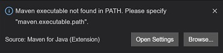

# Managed Identity and Key Vault with Java Spring Boot

> Build a Java Web API application using Managed Identity, Key Vault and Cosmos DB that is designed to be deployed to Azure App Service or AKS


This is a Java Spring Boot Web API reference application designed to "fork and code" with the following features:

- Securely build, deploy and run an App Service (Web App for Containers) application
- Use Managed Identity to securely access resources
- Securely store secrets in Key Vault
- Build and deploy the Docker container to Container Registry
- Connect to and query Cosmos DB
- Automatically send telemetry and logs to Azure Monitor
- Instructions for setting up Key Vault, ACR, Azure Monitor and Cosmos DB are in the Helium [readme](https://github.com/retaildevcrews/helium)

## Prerequisites

- Azure subscription with permissions to create:
  - Resource Groups, Service Principals, Keyvault, Cosmos DB, App Service, Azure Container Registry, Azure Monitor
- Bash shell (tested on Visual Studio Codespaces, Mac, Ubuntu, Windows with WSL2)
  - Will not work in Cloud Shell or WSL1
- Azure CLI ([download](https://docs.microsoft.com/en-us/cli/azure/install-azure-cli?view=azure-cli-latest))
- Docker CLI ([download](https://docs.docker.com/install/))
- Java 8+ ([download](https://www.java.com/en/download/manual.jsp/))
- JQ ([download](https://stedolan.github.io/jq/download/))
- Maven ([download](https://maven.apache.org/download.cgi))
- Visual Studio Code (optional) ([download](https://code.visualstudio.com/download))

## Setup

- Initial setup instructions are in the [Helium readme](https://github.com/retaildevcrews/helium)
  - Please complete the setup steps and then continue below

### Using Visual Studio Codespaces

Visual Studio Codespaces is the easiest way to evaluate helium. Follow the setup steps in the [Helium readme](https://github.com/retaildevcrews/helium) to setup Codespaces.

> NOTE: during container setup, this popup appears and can be ignored as it will resolve once maven installation completes
>
> 

- Open `launch.json` in the `.vscode` directory
- Replace `{your keyvault name}` with the name of your keyvault
  - the file saves automatically
- Press F5
- Wait for `Netty started on ports(s):4120` in the Java Debug Console
- Skip to the testing step below

### Using bash shell

> This will work from a terminal in Visual Studio Codespaces as well

```bash

# set the KeyVault environment variable
export KEYVAULT_NAME=my_keyvault_name

# login to Azure
az login

# run the application
mvn clean package
mvn spring-boot:run

```

wait for `Netty started on port(s): 4120`

### Testing the application

Open a bash shell

```bash

# test the application

http http://localhost:4120/version

```

Stop helium by typing Ctrl-C or the stop button if run via F5

### Build the container using Docker

- The unit tests run as part of the Docker build process

```bash

# Make sure you are in the root of the repo

docker build . -t helium

```

## CI-CD

This repo uses [GitHub Actions](/.github/workflows/dockerCI.yml) for Continuous Integration.

- CI supports pushing to Azure Container Registry or DockerHub
- The action is setup to execute on a PR or commit to ```master```
  - The action does not run on commits to branches other than ```master```
- The action always publishes an image with the ```:beta``` tag
- If you tag the repo with a version i.e. ```v1.0.8``` the action will also
  - Tag the image with ```:1.0.8```
  - Tag the image with ```:stable```
  - Note that the ```v``` is case sensitive (lower case)
- Once the `secrets` below are set, create a new branch, make a change to a file (md file changes are ignored), commit and push your change, create a PR into your local master
- Check the `Actions` tab on the GitHub repo main page

CD is supported via webhooks in Azure App Services connected to the ACR or DockerHub repository.

### CI to Azure Container Registry

In order to push to ACR, you set the following `secrets` in your GitHub repo:

- Azure Login Information
  - TENANT
  - SERVICE_PRINCIPAL
  - SERVICE_PRINCIPAL_SECRET

- ACR Information
  - ACR_REG
  - ACR_REPO
  - ACR_IMAGE

### CI to DockerHub

In order to push to DockerHub, you must set the following `secrets` in your GitHub repo:

- DOCKER_REPO
- DOCKER_USER
- DOCKER_PAT
  - Personal Access Token (recommended) or password

## Contributing

This project welcomes contributions and suggestions.  Most contributions require you to agree to a
Contributor License Agreement (CLA) declaring that you have the right to, and actually do, grant us
the rights to use your contribution. For details, visit [Microsoft Contributor License Agreement](https://cla.opensource.microsoft.com).

When you submit a pull request, a CLA bot will automatically determine whether you need to provide
a CLA and decorate the PR appropriately (e.g., status check, comment). Simply follow the instructions
provided by the bot. You will only need to do this once across all repos using our CLA.

This project has adopted the [Microsoft Open Source Code of Conduct](https://opensource.microsoft.com/codeofconduct/).
For more information see the [Code of Conduct FAQ](https://opensource.microsoft.com/codeofconduct/faq/) or
contact [opencode@microsoft.com](mailto:opencode@microsoft.com) with any additional questions or comments.
