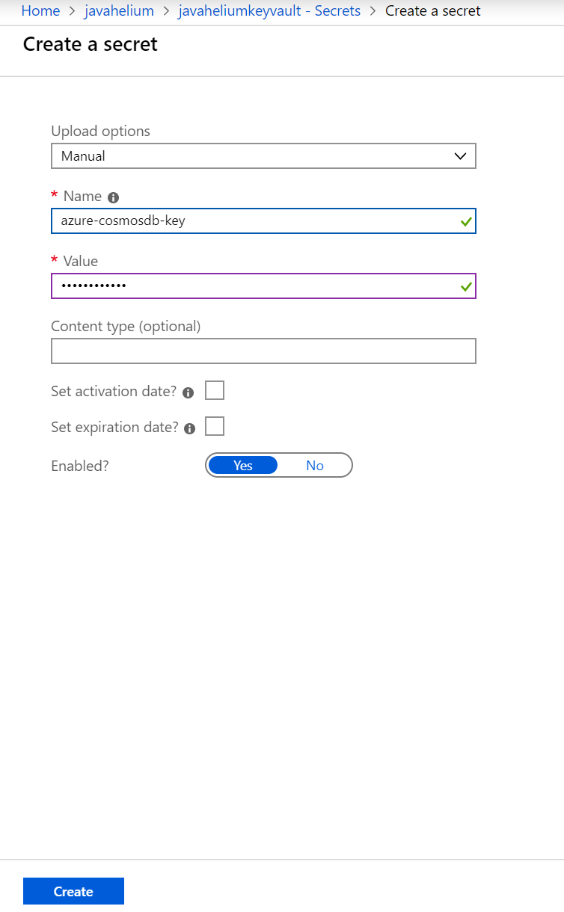
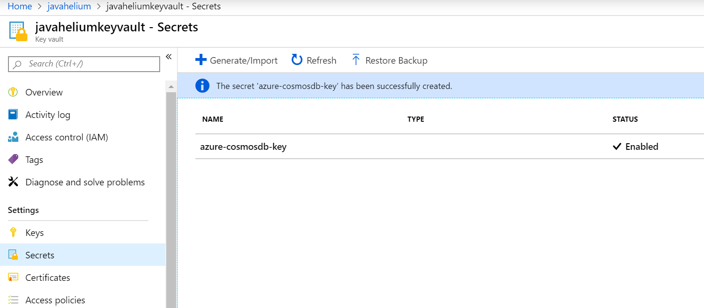

# Setting Up Azure Key Vault

## What is Azure KeyVault?

Cloud applications and services use cryptographic keys and secrets to help keep information secure. Azure Key Vault safeguards these keys and secrets. When you use Key Vault, you can encrypt authentication keys, storage account keys, data encryption keys, .pfx files, and passwords by using keys that are protected by hardware security modules (HSMs).

Key Vault helps solve the following problems:

- Secret management: Securely store and tightly control access to tokens, passwords, certificates, API keys, and other secrets.
- Key management: Create and control encryption keys that encrypt your data.
- Certificate management: Provision, manage, and deploy public and private Secure Sockets Layer/Transport Layer Security (SSL/TLS) certificates for use with Azure and your internal connected resources.
- Store secrets backed by HSMs: Use either software or FIPS 140-2 Level 2 validated HSMs to help protect secrets and keys.

## How to use it

There are several ways to create your Key Vault (Azure Portal, Azure CLI, Terraform, ARM and etc...) and you can easily integrate with different Applications to get or set secrets, certificates and keys. This link will help you to get started creating your first Key Vault trough Azure Portal: https://docs.microsoft.com/pt-br/azure/key-vault/quick-create-portal 

To use in the Helium Java App, please follow the step by step setup in the "Deploying Java Helium App" in docs folder. https://github.com/microsoft/helium-java/docs/deploying-java-helium-app

## Create your secrets and set them in the Java Helium App

You can create secrets trough Azure Portal acessing the Key Vault resource. Please follow this documentation to see how to create a new secret and set its permission: https://docs.microsoft.com/pt-br/azure/key-vault/quick-create-portal

In the Java Helium App you will see in the Appconfiguration file (https://github.com/microsoft/helium-java/src/main/java/com/microsoft/azure/helium/config/RepositoryConfig.java) that the @Value("${azure.cosmosdb.key}") is getting it value from Azure Key Vault. We are using the Azure Key Vault Spring Boot Starter as part of this project and this Starter injects Azure Key Vault dependencies and make the application fetch information from environment variables, application.properties or When you declare a variable trough @Value.


RepositoryConfig.java
````java
    @Value("${azure.cosmosdb.key}")
    private String key;
 ````

The Secret stored in Azure Key Vault must have the same name as the @Value name. Azure Key Vault respects the Java Spring Boot naming convention and the Azure Key Vault Spring Boot Starter, transforms the secret names to respect the naming convention.

Java Spring Boot Azure Key Vault project:
https://github.com/microsoft/azure-spring-boot/blob/master/azure-spring-boot/src/main/java/com/microsoft/azure/keyvault/spring/KeyVaultOperation.java

````java
private String getKeyvaultSecretName(@NonNull String property) {
        if (property.matches("[a-z0-9A-Z-]+")) {
            return property.toLowerCase(Locale.US);
        } else if (property.matches("[A-Z0-9_]+")) {
            return property.toLowerCase(Locale.US).replaceAll("_", "-");
        } else {
            return property.toLowerCase(Locale.US)
                    .replaceAll("-", "")     // my-project -> myproject
                    .replaceAll("_", "")     // my_project -> myproject
                    .replaceAll("\\.", "-"); // acme.myproject -> acme-myproject
        }
    }

    /**
     * For convention we need to support all relaxed binding format from spring, these may include:
     * <table>
     * <tr><td>Spring relaxed binding names</td></tr>
     * <tr><td>acme.my-project.person.first-name</td></tr>
     * <tr><td>acme.myProject.person.firstName</td></tr>
     * <tr><td>acme.my_project.person.first_name</td></tr>
     * <tr><td>ACME_MYPROJECT_PERSON_FIRSTNAME</td></tr>
     * </table>
     * But azure keyvault only allows ^[0-9a-zA-Z-]+$ and case insensitive, so there must be some conversion
     * between spring names and azure keyvault names.
     * For example, the 4 properties stated above should be convert to acme-myproject-person-firstname in keyvault.

````






### Azure Key Vault Starter as a dependency of Java Helium Project

The Azure team created the Starters integrations with Java Spring Boot to help developers be more productive easily integrating Azure Services as part of the Application Framework.

Java Helium App has already the Azure Key Vault Starter pre-configured, but if you want to check the integration and a step by step about how to integrate this in other projects, please check the link below:

https://docs.microsoft.com/pt-br/java/azure/spring-framework/configure-spring-boot-starter-java-app-with-azure-key-vault?view=azure-java-stable

