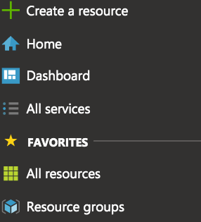
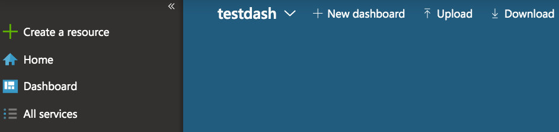
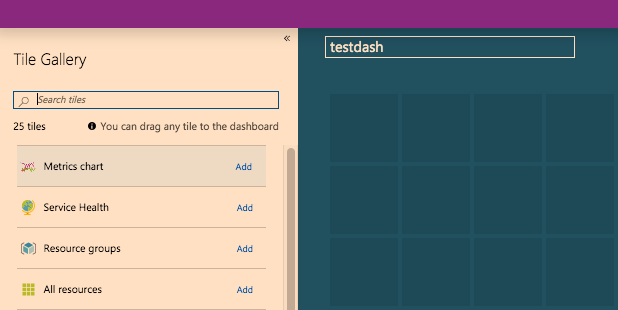
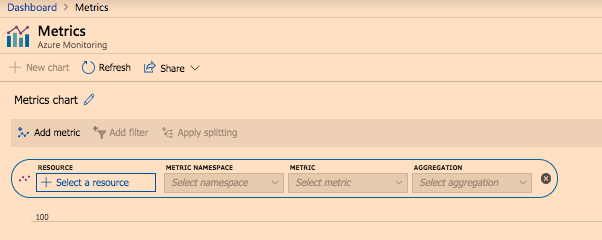
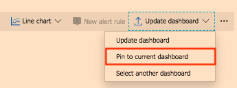
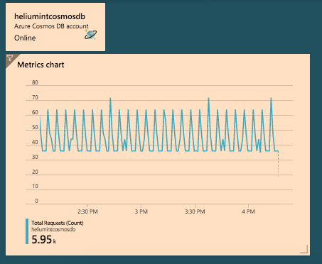
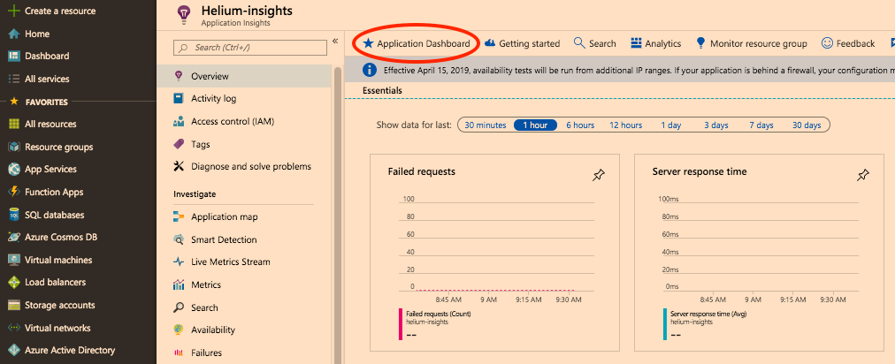
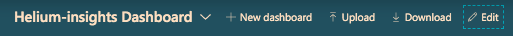
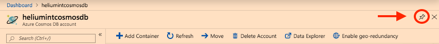
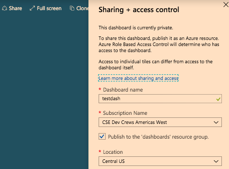

# Setting Up Azure Monitor

## What is Azure Monitor?

Azure Monitor is a Microsoft service which allows users to view metrics and logs from different Azure resources. This can include application monitoring data, Azure resource monitoring data, OS monitoring data, and more.

## How to use it

Azure dashboards allows users to pin and display their Azure Monitor metrics and logs into a single pane. Types of information that can be added to a dashboard include, but are not limited to: Azure Monitor elements, outputs from log queries, or metric charts from Application Insights. Once created, dashboards can be shared for viewing and editing with other Azure users. Read more on this at https://docs.microsoft.com/en-us/azure/azure-monitor/overview.

## Create a Dashboard

There are multiple ways to create a dashboard on Azure. One way is to create an empty dashboard and customize it by adding new items. Otherwise, users can use the dashboard which is automatically created for them with Azure resources, such as Application Insights.

### Option A: Create Custom Dashboard

First, navigate to azure.microsoft.com to begin creating a new dashboard. Once on the main page, click on the list item named "Dashboard" from the left menu panel.

A new menu will show up on the top, where '+ New dashboard' is displayed. Click this to begin customizing.

'Tile Gallery' allows users to select items to drag onto the dashboard and customize from their Azure Resources. Select 'Metrics Chart', and click 'Add' to add Metrics Charts from Azure Monitoring.

Once selected, a new page is loaded where the user can select which resource group to preview metrics from. For example, available metrics for a Cosmos DB resource include available storage, data usage, metadata requests, and more.

Once finished with the metrics, select 'Pin to current dashboard' on the far right side to add it to the dashboard made previously.

Displayed is the new metric added to a custom dashboard! Continue to add more metrics from selecting the 'edit' menu item on the dashboard page, until the dashboard feels complete.

### Option B: Use Pre-populated Dashboard

Navigate to 'Resource Groups', then select the resource group which contains the Application Insights Resource. Once opened, a screen which looks like the following will show up.

Once here, click on 'Application Dashboard'.

[image](imgs/appinsightdash.png)

Here, a beautiful dashboard has been pre-created for the user. As seen before in Option A, more items can be added to this dashboard from the 'tile gallery' or individual resource groups.

#### Edit from Dashboard Page

From the Dashboard page - select 'edit' to add items from the Tile Gallery.

#### Edit from Resource Group Pages

Or, go into a resource group and pin an item from the individual resource group page itself by selecting the pin in the far right corner.

Once all dashboards are complete, select 'share', and add a subscription group in order to share with other Azure users.

